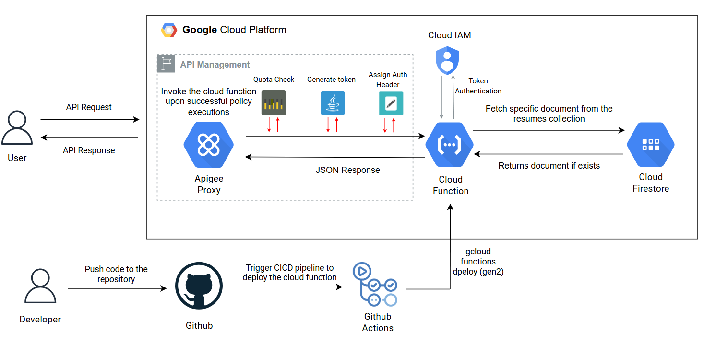
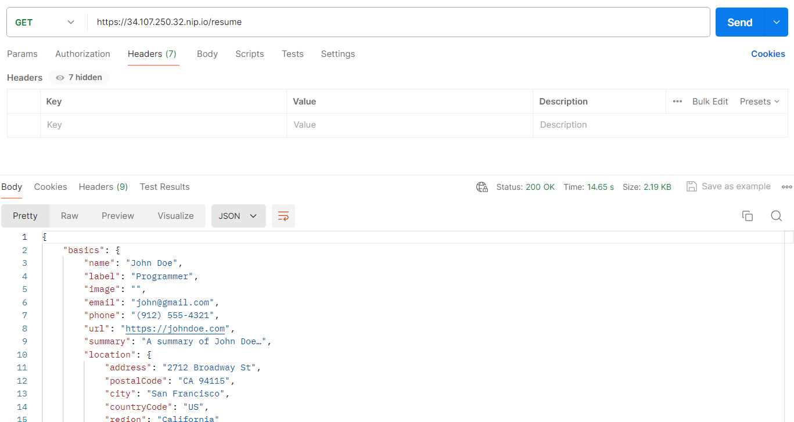
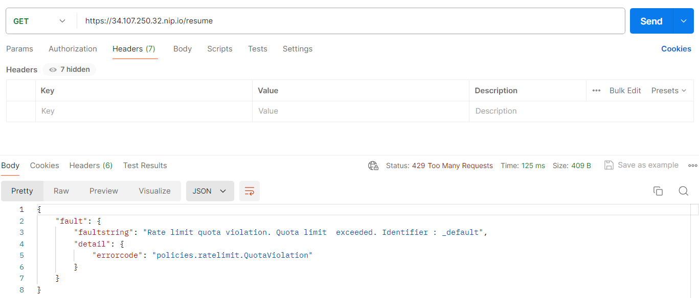

## Overview
This repository contains the resources for my submission to the Cloud Resume API Challenge using GCP as the cloud service provider. The challenge involves building a serverless function that fetches resume data stored in a NoSQL database and returns it in JSON format. Additionally, it integrates GitHub Actions to automatically deploy updates to your cloud serverless function whenever you push to your repository.

## High-Level Design
This design leverages the power of Google Cloud Platform services to manage API requests, handle authentication, execute backend logic, and retrieve data efficiently. The integration with GitHub and GitHub Actions ensures a seamless development and deployment workflow, enhancing productivity while maintaining high standards of security and performance.



## Key Components
### **User Interaction**:
   - **API Request & Response**: Users send API requests and receive responses through the Apigee Proxy.
### **API Management with Apigee Proxy**:
   - **Apigee Proxy**: Acts as a facade for the serverless function, providing a secure and scalable API endpoint for external users. This is crucial because exposing the cloud function to public users can overwhelm the system, causing it to go down and increasing costs. 
   - **Quota Check**: Ensures that the API usage complies with defined quotas.
   - **Token Generation & Assignment** : Generates and assigns an ID token to the request URL invoking the cloud function, as the function requires authentication to execute the code. 
### **Cloud Functions**:
   - **Cloud Function**: The serverless function that fetches resume data from Firestore and returns it in JSON format. It is triggered by an HTTP request and requires an ID token for authentication.
   - **Deployment**: Cloud Functions are deployed using the gcloud functions deploy command, initiated by GitHub Actions.
### **Cloud IAM (Identity and Access Management)**:
   - **Token Authentication**: Ensures that only authorized users can access the cloud function by validating the ID token in the request URL.
### **Cloud Firestore**:
   - **Data Storage:**: Stores the resume data in a structured format, enabling efficient retrieval by the cloud function.
### **Development & Deployment Process**:
   - **GitHub Repository**: Contains the source code for the cloud function and the GitHub Actions workflow.
   - **GitHub Actions**: Automatically deploys the cloud function whenever changes are pushed to the repository, ensuring a continuous integration and deployment pipeline.

## Getting Started
### **Prerequisites**:
1. Google Cloud Platform account with billing enabled.
2. `gcloud` CLI installed and configured with your GCP account.
3. Apigee account for managing APIs (Optional) - You can use the Cloud Functions URL directly if you don't want to use Apigee.
4. GitHub account for version control and CI/CD.
### **Setup & Deployment**:
1. **Create a new project in GCP**.
   - Open the GCP Console and navigate to the project selector.
   - Click on `New Project` and enter a name for your project.
   - Click on `Create` to create the project.
   - Note down the Project ID, as you will need it later.
   - Enable billing for the project.
2. **Enable APIs**.
   - Navigate to the `APIs & Services` section in the GCP Console.
   - Click on `Enable APIs and Services`.
   - Enable the following APIs:
     - Cloud Functions API
     - Cloud Run Admin API
     - Firestore API
     - Cloud Resource Manager API
     - Apigee API (Optional)
3. **Create Service Accounts**.
    - Navigate to the `IAM & Admin` section in the GCP Console.
    - Click on `Service Accounts` and create the following service accounts.
        - `firestore-reader` for reading data from Firestore with following roles. To be used by the cloud function.
            - `Cloud Datastore User`
        - `github-actions` for deploying the cloud function using GitHub Actions.
            - `Cloud Functions Admin, Cloud Run Admin, Service Account User`
        - `apigee-proxy` for invoking the cloud function using Apigee (Optional).
            - `Cloud Functions Invoker, Cloud Run Invoker`
4. **Create a Firestore Database**.
   - Navigate to the `Firestore` section in the GCP Console.
   - Click on `Create Database`.
   - Choose the `Native Mode` and click on `Next`.
   - Select a location for your database and click on `Create`.
5. **Load Data into Firestore**.
   - Create a new collection in Firestore and add the resume data in JSON format.
   - Refer schema in `resume.json` for the resume data structure.
6. **Create a Cloud Function**.
   - Write the cloud function code to fetch data from Firestore and return it in JSON format. Refer this repository for sample code `src/main/java/demo/GetResumeData.java`.
7. **Set up GitHub actions**.
   - Create a new repository in GitHub and add the cloud function code.
   - Create a new GitHub Actions workflow to deploy the cloud function whenever changes are pushed to the repository. Refer this repository for sample workflow `.github/workflows/deploy.yml`.
   - You will need to add the following secrets to your repository:
     - `GCP_PROJECT_ID`: The ID of your GCP project.
     - `GCP_REGION`: The region where you want to deploy the cloud function.
     - `GCP_SA_KEY`: The service account key for the `github-actions` service account.
8. **Build and deploy the cloud function**.
   - Push the changes to your repository to trigger the GitHub Actions workflow.
   - The workflow will build and deploy the cloud function to GCP.
   - Command used by GitHub Actions to deploy the cloud function:
     ```bash
     gcloud functions deploy resume-api \
            --entry-point demo.GetResumeData \
            --runtime java11 \
            --trigger-http \
            --no-allow-unauthenticated \
            --region ${{ vars.GCP_REGION }} \
            --project ${{ vars.GCP_PROJECT_ID }} \
            --memory 512MB \
            --timeout 90s \
            --min-instances 0 \
            --max-instances 1 \
            --service-account firestore-poc@precise-tube-429809-s4.iam.gserviceaccount.com \
            --gen2
     ```
   - Please note that the `--no-allow-unauthenticated` flag is used to enforce authentication for the cloud function and it requires an ID token to be passed in the request URL. This will be generated by the Apigee Proxy in the next step. You can remove this flag if you want to allow unauthenticated access.
9. **Set up Apigee Proxy** (Optional) - If you want to use Apigee for API management.
   - Create a new API proxy in Apigee and configure it to invoke the cloud function.
   - Configure the cloud function url as the target endpoint for the proxy.
   - Add a quota policy to limit the number of requests per minute. For example, you can set the quota to 100 requests per minute.
   - Add another policy to generate an ID token and pass it to the cloud function in the request URL. You can read more about generating ID tokens in Apigee [here](https://cloud.google.com/functions/docs/securing/authenticating#id-tokens).
10. **How to run it?**:
    - Once the cloud function is deployed, you can access it using the URL generated by the deployment command.
    - If you are using Apigee, you can access the cloud function through the Apigee proxy URL.

### **Testing**:
**Demo URL**
```
https://34.107.250.32.nip.io/resume
```
**Sample Response**



**Sample Quota Exceeded Response**

The quota policy is set to 10 requests per minute in the Apigee proxy. If the quota is exceeded, the user will receive the following response.



## How to test cloud function locally? - Bonus
1. **Install the Google Cloud SDK**.
   - Download and install the Google Cloud SDK from [here](https://cloud.google.com/sdk/docs/install).
   - Run `gcloud init` to authenticate with your GCP account.
   - Set the project ID and region using the following commands:
     ```bash
     gcloud config set project <PROJECT_ID>
     gcloud config set run/region <REGION>
     ```
2. **Run the cloud function locally**.
  - Add the dependencies in the `pom.xml` file.
    ```xml
    <dependency>
        <groupId>com.google.cloud.functions.invoker</groupId>
        <artifactId>java-function-invoker</artifactId>
        <version>1.0.0</version>
    </dependency>
    ```
  - Create a Main function and add the following code to invoke the cloud function.
    ```
    Invoker.main(new String[] {
                "--target", "demo.GetResumeData",
                "--port", "8081"
        });
    ```
## Future Enhancements
1. **Caching**: Add caching mechanisms to improve the performance of the cloud function by reducing the number of requests to Firestore.
2. **Monitoring & Logging**: Set up monitoring and logging for the cloud function to track usage, performance, and errors.